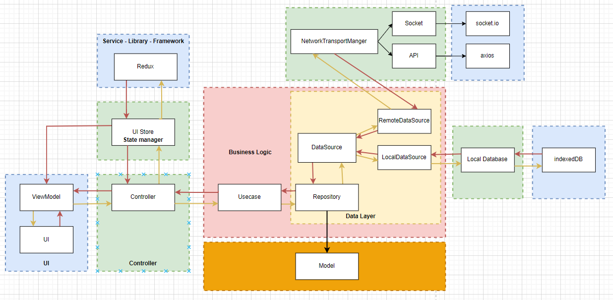

# dm-chat-app

Chat app web UI

Simple web/pc chat application built with react and electron frameworks following clean architecture design

# Architect

This architect ensured scalability and easy to read/maintain code. But in the actual code there will be some un-fix ugly code that haven't follow this design

# Local Database - Indexed DB

final design for scalability chat conversation and avoiding duplicated data, there's still in the code that i haven't fix yet

# Full-text-search mechanism

Message searching using full-text-search mechanism desinged on top indexeddb for fast and percise searching

There will be 2 phases which is searching and indexing following the image below

> TODO : Use worker for better performance

# UI/UX features

## Dark mode

## Multilingal

